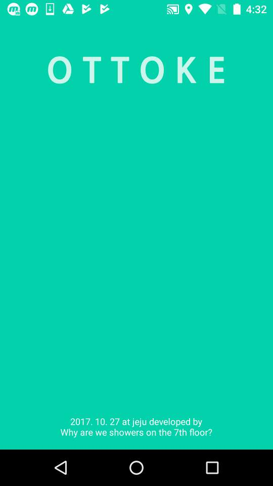
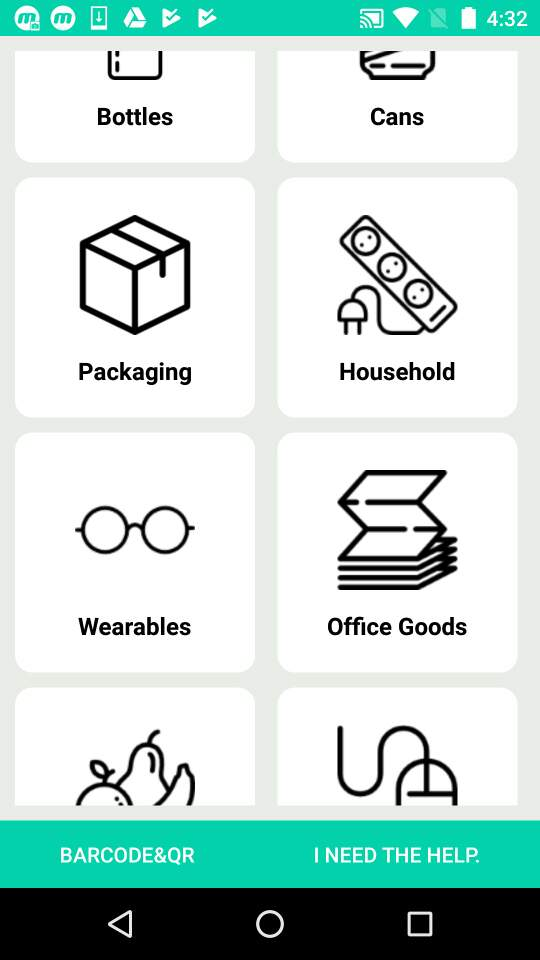
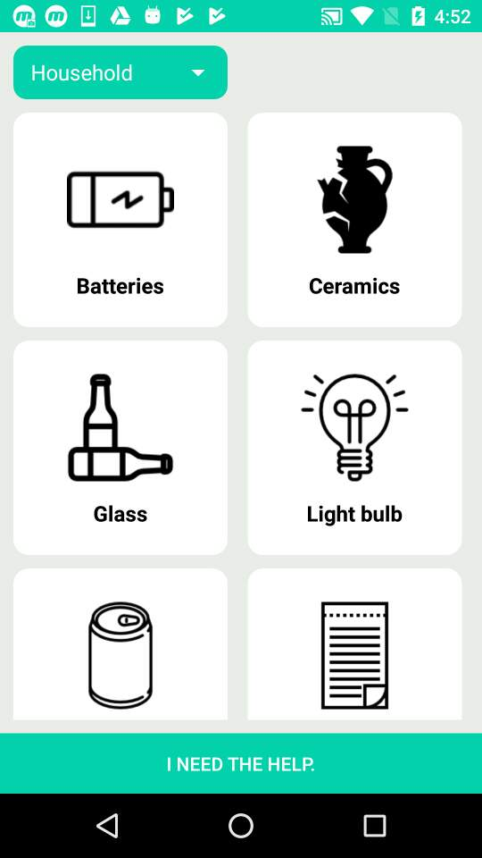
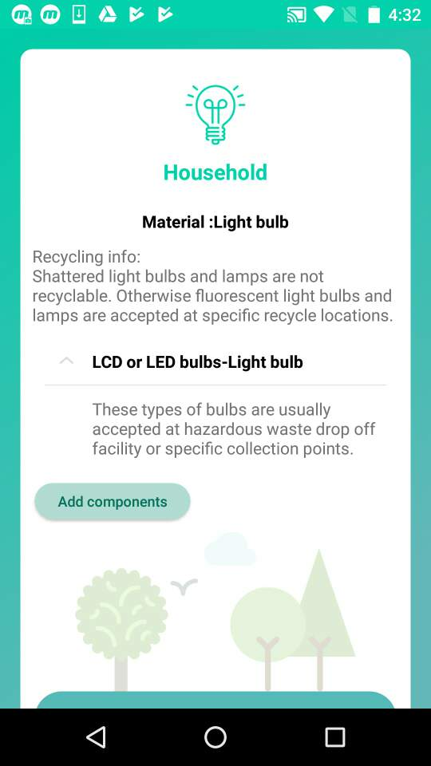
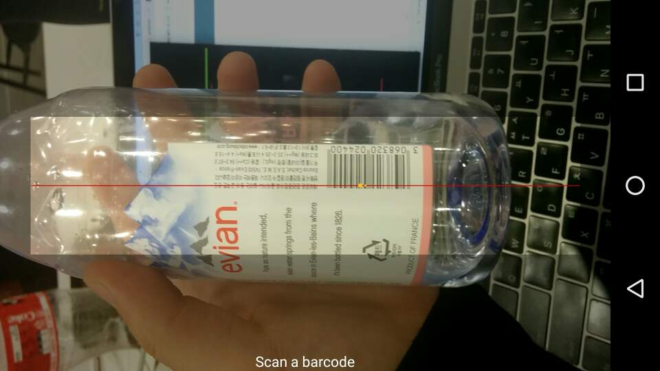

# TellMeHow / Ottoke

Ottoke (*Tell me how* in Korean) is an Android based application that raises recycling awareness.

# Features
## Core feature
The main feature is to provide recycling information for any kind of waste, in only two clicks, considering its product category.

|  Main categories |  Category Selected |  Recycling Information |
|:---:|:---:|:---:|

## Product identification by barcode
The user can scan the barcode of a product to get more specific recycling information. It uses the library [Zxing](https://github.com/zxing/zxing "Zxing library").

## Help engine
In case of trouble, the user is redirected to Google'es search engine.

# Related repositories
The Backend can be found here : [TellMeHowBackend](https://github.com/hassanabidpk/tellmehow "TellMeHow Django Backend")

# Origins
This application is the result of the team "Why are the showers on the 7th floor?" constituted specifically for the Global Hackathon in Jeju 2017.

